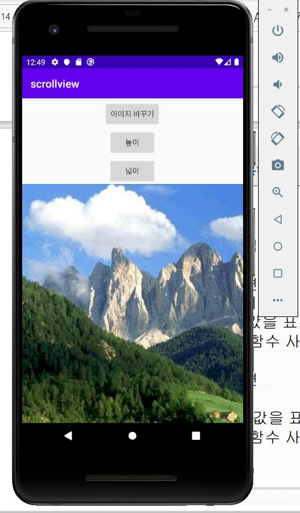

# MyFirstRepository

19273013 황채영
## 1주차 과제
</img>

## 2주차 과제
</img>

## 3주차 과제
</img>

## 4주차 과제
   
   - 아이디어 명 : 야옹아
   - 아이디어 : 고양이 사진을 올리고 관련된 이야기를 할 수 있는 커뮤니티앱입니다. 
                길고양이, 집고양이 사진등을 공유하고 생활정보를 공유하는 앱입니다.
                
## 7주차 과제

</img>
</img>

## 9주차 과제

</img>
</img>
</img>

## 10주차 과제

</img>
